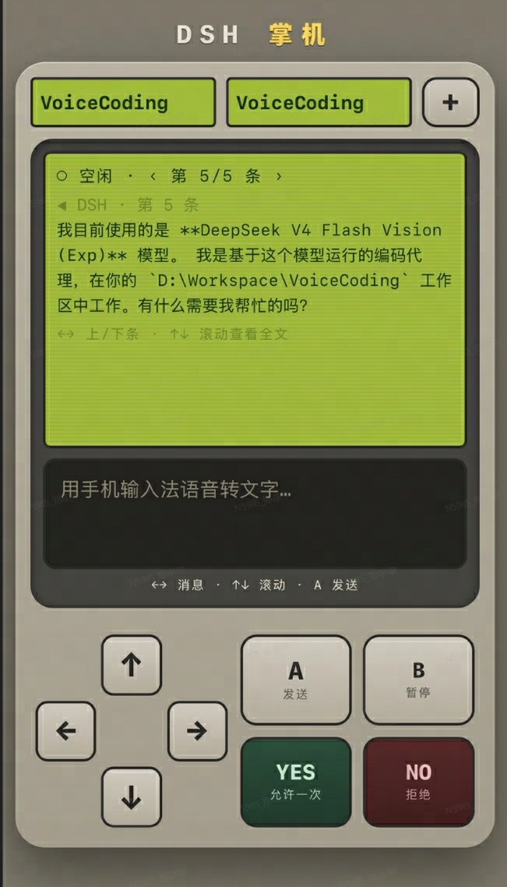

# dsh-gb · 掌机

<div align="center">
  <b>把手机变成 DSH 的语音遥控外设</b><br />
  同一局域网扫码即连（或开启内置公网隧道，任意网络可用）：语音输入 · 审批 yes/no · 选择题 · 摇杆浏览 + 实时状态小屏
  <br /><br />
  <a href="https://opensource.org/licenses/MIT"></a>
  <a href="https://github.com/zingzheng/dsh-gb/stargazers"></a>
  <a href="https://www.npmjs.com/package/@deepseek-ai/dsh?activeTab=versions"></a>
  <br /><br />
  
  
  
  
</div>

DSH 网页版「掌机」插件：手机和电脑连同一个 Wi-Fi，用手机扫一个二维码，手机就变成
DSH 的**外设遥控器 + 小状态屏**——你坐在电脑前，手机随手一瞥就是 agent 的运行状态，
消息、审批、选择题都能在手机上直接处理。手机不在同一网络时，可在设置页开启内置
**公网隧道**，任意网络（4G/异地 WiFi）扫码即连，无需再装花生壳等外部服务。

<div align="center">
  
</div>

## ✨ 功能一览

- **📡 实时状态栏**：当前工作区 / 会话 / agent 状态（`● 运行中` / `○ 空闲` / 待审批 /
  选择题）+ 一行总结 + 消息浏览进度（`‹ 第 N/M 条 ›`）。
- **🎤 语音输入**：直接调用手机输入法的语音转文字，A 键 / 回车发送进当前会话。
- **✅ 审批**：`YES` = 允许一次、`NO` = 拒绝，与 GUI 审批面板语义一致；有待审批时
  键位高亮闪烁提醒。
- **🔢 选择题**：`↑↓` 选选项、`←→` 翻题，A 键发送 = 提交整组答案。
- **🎮 摇杆与按键**：正常模式下 `←→` 上一条 / 下一条消息、`↑↓` 滚动查看完整消息；
  `B` 暂停（中断运行中的 agent，等价 GUI 停止）。
- **🔀 会话管理**：顶部下拉切换工作区 / 会话，`＋ 新建会话` 一键开新会话。
- **🖥️ GUI 设置页「掌机」**：动态二维码、连接 URL、在线手机数 / 桥接状态 / 消息数实时统计。
- **🌐 公网隧道（内网穿透，可选）**：设置页顶部「内网模式 / 公网模式」一键切换
  （默认内网）；内置 cloudflared（首次启用自动下载，缓存于 `~/.dsh/cache`）；
  「快速隧道」零账号零配置出临时公网地址，「命名隧道」用自带域名出**固定**地址——
  手机在任意网络扫码即连，替代花生壳等外部服务，无需在电脑/手机上运行额外软件。
- **🔋 零运行时依赖**：二维码编码器为内置实现（无任何 npm 运行时依赖）；令牌鉴权 +
  收紧 CORS；`/info` 仅限本机回环。

## 🚀 安装

**前置**：`dsh web` 能正常运行，Node.js ≥ 20、pnpm ≥ 10、git。

**支持的 DSH 版本**：

### 方式一：一条命令

```sh
dsh plugin --profile web add github:zingzheng/dsh-gb
```

> 包名写完整 git 地址也可以：`dsh plugin --profile web add https://github.com/zingzheng/dsh-gb.git`

这条命令会在 profile 里安装依赖，并自动把声明了 `dsh.bundle` 的本插件加入挂载层
（无需手动改 `cordis.patch.yml`）。装完 **重启 dsh**（插件带 host 半部，只在启动时
挂载），然后在 GUI 设置 →「掌机」扫码连接。

如果提示「找不到 profile 目录」，先跑一次 `dsh web` 初始化 `~/.dsh/profiles/web` 即可。

### 方式二：把这段话贴给 DSH（懒得敲命令）

把下面这段提示词发给任意一个 DSH 会话，让它自己装：

```text
帮我安装 dsh-gb 插件（DSH 掌机：手机扫码变成 DSH 的 Game Boy 遥控台 + 小状态屏），步骤：
1. 执行 dsh plugin --profile web add github:zingzheng/dsh-gb
2. 完成后提醒我重启 dsh（host 半部只在启动时挂载），再硬刷新浏览器（Ctrl/Cmd+Shift+R）
3. 遇到报错先查 https://github.com/zingzheng/dsh-gb 的 README「常见问题」。
```

### 方式三：从源码安装 / 开发（可选）

```sh
git clone https://github.com/zingzheng/dsh-gb.git
cd dsh-gb
pnpm install                 # 只装测试依赖（qrcode / jsqr）
node scripts/build-client.mjs
```

开发挂载二选一（与「方式一」的自动挂载**互斥**，勿同时使用，否则会重复挂载报错）：

1. 把 `~/.dsh/profiles/web/package.json` 依赖指向本地克隆：
   `"dsh-gb": "link:D:/path/to/dsh-gb"`（开发迭代推荐 Windows junction 连到该目录）；
2. 在 `~/.dsh/profiles/web/cordis.patch.yml` 追加与插件 `cordis.patch.yml` 相同的行：
   ```yaml
   - insert:
       - id: dsh-gb
         name: 'dsh-gb'
   ```

然后 `pnpm install`、重启 dsh、硬刷新浏览器。`lib/client.js` 已提交仓库（git 安装
零构建、无构建脚本审批），改动 host 半部需重启 dsh，client 半部硬刷新即可。

<details>
<summary><b>更新</b></summary>

重跑同一条安装命令（git 依赖会重新解析最新提交），然后重启 dsh：

```sh
dsh plugin --profile web add github:zingzheng/dsh-gb
```

</details>

<details>
<summary><b>常见问题</b></summary>

| 现象 | 原因与解决 |
|---|---|
| 报 `duplicate loader entry id` / 页面出现两个「掌机」 | 自动挂载与手动行重复：删除 `~/.dsh/profiles/web/cordis.patch.yml` 里 dsh-gb 的 `insert` 行。 |
| 设置页报「未检测到本地掌机服务」 | 多因版本激活时机导致同源路由未注册：重跑一次安装命令（git 依赖会拉到最新提交）、重启 dsh、硬刷新浏览器。若是在**另一台设备**上访问 GUI（隧道/远程），请确认用的是新版本（含同源 /phone-remote/* 代理与 hostname 扫描）。 |
| 报 `dsh: command not found` | 先安装 DSH；或 `npx -y --package @deepseek-ai/dsh dsh plugin --profile web add github:zingzheng/dsh-gb`。 |
| 找不到 profile 目录 | 先跑一次 `dsh web` 初始化 `~/.dsh/profiles/web`。 |
| 手机上打不开页面 / 二维码转圈 | 手机与电脑须在同一局域网；放行 dsh（Node.js）通过 Windows 防火墙（专用网络）；检查路由器是否开了 AP 隔离。 |
| 端口被占用 | 服务器会在 `7788–7795` 自动顺延（二维码显示实际端口）。 |
| 提示构建脚本被拦截 | 本插件无 prepare 脚本，一般不会出现；如其他插件环境报此错，在 profile 目录允许对应包即可。 |
| 改了插件代码不生效 | host 半部（`lib/index.js`、`server-core.js`、`phone-page.js`、`tunnel.js`）需重启 dsh；client 半部（`client-src.js`）硬刷新浏览器。 |
| 公网隧道一直失败 / 状态区显示「下载失败」 | 首次启用需联网访问 GitHub（约 30-60MB），公司网络/代理可能拦截：可设环境变量 `DSH_GB_CLOUDFLARED_URL` 指向镜像。命名隧道先到 Cloudflare 控制台建好隧道并把公共主机名映射到 `http://127.0.0.1:<设置页显示的掌机端口>`（默认 `7788`）。 |
| 快速隧道里「运行中」但手机打不开 | 刚进入运行状态时 Cloudflare 边缘可能还要几秒生效；隧道进程异常退出后插件按退避自动重启，且每次重启**换新地址**（设置页二维码会更新）。 |

</details>

## 📱 使用注意

- 手机与电脑需同一局域网；局域网其他设备即使拿到 URL 也**无法**使用（页面与 API
  均要求随机令牌；令牌**首次启动生成并持久化**于 `~/.dsh/dsh-gb.token`，重启 dsh
  不变，二维码与 URL 可收藏长期使用；设置页「重置令牌」可一键作废旧令牌）。
- 开启公网隧道后二维码即公网地址（含令牌），手机在任意网络可用；「快速隧道」地址
  在重启 dsh 后变化（重新扫码即可），「命名隧道」地址固定。**隧道地址请勿外传**。
- 设备间通信端口默认 `7788`，被占用时自动顺延至 `7795`。
- 审批语义为「允许一次」（与 GUI 审批面板一致）。

## 📌 远程访问

手机访问掌机有三条路径（按推荐顺序）：

1. **局域网直连（默认）**：手机与运行 dsh 的主机在同一 Wi-Fi，扫码即用，零配置。
2. **内置公网隧道（推荐，实验性）**：设置页顶部切换到「公网模式」一键开启——
   - **快速隧道**：零账号、零配置，`cloudflared` 自动出临时公网地址
     （`*.trycloudflare.com`），手机在任意网络（4G/异地 WiFi）扫码即连；
     地址在 dsh 每次重启后**会变化**，重新扫码即可，无需任何外部服务。
   - **命名隧道**：用**自带域名**出**固定**地址——在 Cloudflare 控制台创建隧道并把
     公共主机名（如 `dsh.example.com`）映射到 `http://127.0.0.1:<掌机端口>`，
     再把「隧道 Token」与主机名填入设置页；地址永久不变，书签/收藏长期有效，
     是花生壳的完全替代（免费、无流量限制、无需在电脑上另开服务）。
   - cloudflared 二进制在**首次启用时自动下载**（约 30-60MB，缓存于
     `~/.dsh/cache/dsh-gb/`，之后复用），下载源可由环境变量
     `DSH_GB_CLOUDFLARED_URL` 更换（受限网络走镜像）；下载失败会在设置页
     状态区给出原因，并自动重试（进程异常退出时插件会按退避自动重启隧道）。
   - 隧道运行时，二维码与 URL 自动切换为公网地址；本地局域网直连不受影响。
   - ⚠️ 已知限制：Cloudflare 快速隧道等部分代理**只透传 SSE 响应头、缓冲/丢弃数据体**
     ——手机页会在 4 秒内自动降级为 `/state` 轮询（每 2.5s），功能完全可用
     （状态刷新略延迟约 2.5s，界面会提示「已切换轮询模式」）；局域网直连与命名隧道
     下仍为实时 SSE。若需完全实时就绪体验，建议局域网或命名隧道。
3. **自备隧道 / 组网（可选）**：用你已有的任何穿透方案（花生壳、frp、SSH 反向隧道、
   Tailscale 组网等）把本机 `7788` 端口转发出去，手机直接打开
   `https://<你的隧道地址>/?t=<令牌>` 即可用（令牌从本机设置页复制；二维码此时仍是
   局域网 URL，不含你的穿透地址）。浏览器侧远程则转发 GUI 端口即可（见下方说明）。

> ⚠️ 隧道地址是公开的，掌机的鉴权**唯一依赖** URL 里的随机令牌（页面 / SSE / API
> 全部要求令牌）——不要转发/截图给无关的人；令牌可在设置页一键重置（全部旧链接
> 立即作废）。设置「掌机」面板中的隧道配置与令牌重置**仅限本机回环**操作（局域网/
> 远程来源打开时为只读并显示提示横幅）。

- ✅ **浏览器侧远程（GUI 本身）**：GUI 经隧道/代理访问时，bridge 与设置页走 dsh
  webServer 的**同源代理**（`/phone-remote/*`）——只需把 GUI 端口转发到本地，
  全部状态与操作即可工作（VNC / SSH 隧道场景证实可用）。

## 🔐 安全

- 全部接口（页面 / SSE / 动作 API）要求随机令牌（首次启动生成后持久化于
  `~/.dsh/dsh-gb.token`，128 位随机，可经设置页「重置令牌」作废）；`/info`
  仅限本机回环访问（经 webServer 同源路由对非回环来源脱敏，不含令牌/URL）；
  动作接口收紧 CORS，仅放行同源应用。
- 服务器只监听局域网 `0.0.0.0:7788+`，不直接暴露公网、无外联行为；公网可达性仅在
  用户**显式开启公网隧道（或自备隧道）**时由出站连接建立——隧道地址公开，鉴权
  唯一依赖随机令牌；关闭隧道即回到纯局域网。
- 控制端点（隧道配置 `/phone-remote/tunnel`、令牌重置 `/phone-remote/token/reset`）
  **仅限本机回环**，局域网/远程来源一律 403；设置页为只读并显示提示横幅。
- 首次启用隧道时运行时下载 cloudflared 二进制（GitHub 官方 release，可用
  `DSH_GB_CLOUDFLARED_URL` 换源）——与「零构建 / 无 postinstall」承诺兼容：
  没有构建脚本，下载发生在运行时且可随时关闭。

## 🧩 架构一览

插件为 host / client 双半部，构建后零运行时依赖：

```
手机 ──SSE(状态)/POST(动作)──> 局域网HTTP服务器(0.0.0.0:7788+) <──POST/bridge/state── GUI客户端中继
                                    │  ^
                                    └──SSE(bridge/events: 命令)──┘
```

- **Host 半部**（`lib/index.js` + `lib/server-core.js`）：局域网 HTTP 服务器（手机页 /
  SSE / 动作 API / 令牌鉴权 / CORS），监听 `agent/status` 与会话事件维护运行态与
  一句话总结；`send` 动作直接 `followup` 注入当前会话；另在 dsh 自带 webServer
  注册同源 `/phone-remote/info`（设置页二维码数据源）。
- **Client 半部**（`lib/client.js`，由 `lib/client-src.js` + `lib/qr.js` 构建）：
  - `conversation.composer.dock` 会话槽挂不可见中继：推送审批 / 选择题 / 会话与工作区
    列表到服务器，并执行打开会话 / 连接工作区 / 应答（复用 GUI 同款
    `PendingWait.respond`）。
  - `settings.section` 设置页「掌机」：内置 QR 编码器（零依赖）生成动态二维码。

## 🛠️ 开发与测试

```sh
pnpm install                    # 测试依赖：qrcode / jsqr
node scripts/build-client.mjs   # 改 lib/client-src.js / lib/qr.js 后重新打包 client
node test/check-qr.mjs          # QR 编码器 vs node-qrcode / jsQR 交叉校验
node test/serve.mjs             # 服务器核心端到端冒烟（页面 / SSE / API / 令牌 / 导航）
node test/client-bundle.mjs     # client bundle 假装载校验
```

提交前建议跑 `node test/check-qr.mjs && node test/serve.mjs && node test/client-bundle.mjs`
三者全绿，并确保 `lib/client.js` 已重新构建后一起提交。

## 📄 License

[MIT](./LICENSE)
